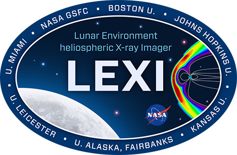

:tocdepth: 3

.. _lexi-documentation:

==================
LEXI Documentation
==================

.. important::

    The package is still under development and is not yet ready for public use. The documentation
    is also a work in progress.

.. _LEXI: https://lexi-bu.github.io/

LEXI is a Python package for the analysis of data from the `LEXI`_ imager aboard the Blue Ghost
Mission by FireFly Aerospace. The package provides tools for the analysis of cdf files that we
receive from the `LEXI`_ imager.

The package is developed by the LEXI team at Boston University and is open-source. The source code is
available on `GitHub <https://github.com/Lexi-BU/lexi>`_ under the GNU General Public License v3.0.

.. toctree::
   :caption: Contents:
   :maxdepth: 5

   Installation <install>

.. toctree::
   :hidden:

   functions

.. automodule:: lexi.lexi
   :members:
   :undoc-members:
   :show-inheritance:

.. autosummary::
   :toctree: _autosummary
   :template: function.rst
   :nosignatures:
